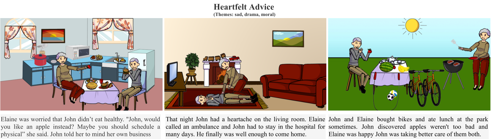

# AESOP: Abstract Encoding of Stories, Objects and Pictures (ICCV 2021)
[Hareesh Ravi](https://hareesh-ravi.github.io/) | [Kushal Kafle](https://kushalkafle.com/) | [Scott Cohen](https://research.adobe.com/person/scott-cohen/) | [Jonathan Brandt](https://research.adobe.com/person/jonathan-brandt/) | [Mubbasir Kapadia](https://ivi.cs.rutgers.edu/)  

This is the official repository for our ICCV 2021 paper "AESOP: Abstract Encoding of Stories, Objects and Pictures".   

#### ABSTRACT:
Visual storytelling and story comprehension are uniquely human skills that play a central role in how we learn about and experience the world. Despite remarkable progress in recent years in synthesis of visual and textual content in isolation and learning effective joint visual-linguistic representations, existing systems still operate only at a superfi cial, factual level. With the goal of developing systems that are able to comprehend rich human-generated narratives, and co-create new stories, we introduce AESOP: a new dataset that captures the creative process associated with visual storytelling. Visual panels are composed of clipart objects with specifi c attributes enabling a broad range of creative expression. Using AESOP, we propose foundational storytelling tasks that are generative variants of story cloze tests, to better measure the creative and causal reasoning ability required for visual storytelling. We further develop a generalized story completion framework that models stories as the co-evolution of visual and textual concepts. We benchmark the proposed approach with human baselines and evaluate using comprehensive qualitative and quantitative metrics. Our results highlight key insights related to the dataset, modelling and evaluation of visual storytelling for future research in this promising fi eld of study.

## ICCV 2021 Materials

[Paper](./iccv2021/aesop_camera_ready.pdf) | [Appendix](./iccv2021/aesop_camera_ready-supp.pdf) | [Video Presentation](https://youtu.be/ygGzY1DSSMk) | [Poster](./iccv2021/AESOP_ICCV2021_POSTER.pdf) | [Video Slides](./iccv2021/AESOP_ICCV2021_SLIDES.pdf) | [arXiv]()  

## Dataset: Coming Soon!

## Code: Coming Soon!

## Reference
>@InProceedings{Ravi_2018_CVPR,  
>author = {Ravi, Hareesh and Kafle, Kushal and Cohen, Scott and Brandt, Jonathan and Kapadia, Mubbasir},  
>title = {AESOP: Abstract Encoding of Stories, Objects and Pictures},  
>booktitle = {Proceedings of the IEEE/CVF International Conference on Computer Vision (ICCV)},  
>month = {October},  
>year = {2021},  
>pages = {2052-2063}  
>}

## Acknowledgement
The web interface for data acquisition and most of the clipart objects are from [Abstract Scenes](https://github.com/GT-Vision-Lab/abstract_scenes_v002) dataset.

## Contact
Hareesh Ravi:  
haravi@adobe.com  
haree.24@gmail.com  
https://hareesh-ravi.github.io  
